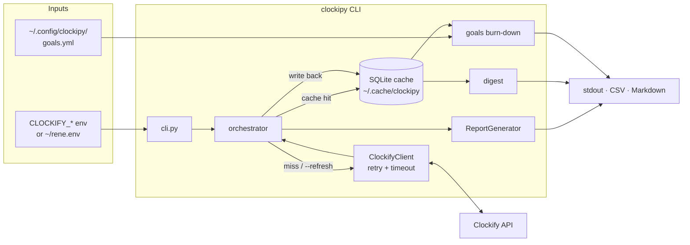

# clockiPy

> A personal time-analytics CLI for [Clockify](https://clockify.me/) that
> turns tracked hours into planned-vs-measured deviation tables, weekly
> burn-downs, and anomaly callouts — instantly, from a local cache.

---

## Setup (60 seconds)

```bash
# 1. Get the code & bootstrap the venv (installs runtime + dev deps)
git clone <this-repo-url> clockiPy && cd clockiPy
./scripts/bootstrap_venv.sh
source .venv/bin/activate

# 2. Tell clockiPy who you are (one of: env, ~/rene.env, ./clockipy.env)
export CLOCKIFY_API_KEY=ck_...
export CLOCKIFY_WORKSPACE_ID=...

# 3. Sanity check
clockipy --list
```

`--list` prints your user record + every workspace you can access — use
it to grab the right `CLOCKIFY_WORKSPACE_ID`.

Full precedence rules & env-file format: [docs/credentials.md](docs/credentials.md).

---

## Run It (Single Command)

The fastest path is a mode-driven report. Pick a mode, give it a date,
done:

```bash
clockipy --mode week                              # this week
clockipy --mode month --start 2026-05-01          # specific month
clockipy --mode year  --start 2026-01-01 --breakdown   # year w/ monthly breakdown
clockipy --start 2026-05-15 --end 2026-05-22      # free-form range
```

Second runs hit a local SQLite cache — instant. Force a refresh with
`--refresh`; bypass entirely with `--no-cache`
([docs/cache.md](docs/cache.md)).

Three additional one-shot commands ship out of the box:

| Command                | What it does                                                  |
| ---------------------- | ------------------------------------------------------------- |
| `clockipy --list`      | Print your user info + every workspace and exit.              |
| `clockipy --goals`     | Show this week's burn-down against `~/.config/clockipy/goals.yml`. |
| `clockipy --digest`    | Weekly summary with Δ-vs-4-week-median anomaly callouts.      |

All flags & exit codes: [docs/cli-reference.md](docs/cli-reference.md).

---

## How It Fits Together



The orchestrator is the single seam: it decides whether to serve from
cache or call the API, then routes results through the right renderer
(report / digest / burn-down). Deeper map:
[docs/architecture.md](docs/architecture.md).

---

## Planned vs Measured

Encode plans inside task descriptions; deviation columns appear
automatically in every summary table:

```
Deep work {p2:00}         → 2h00 planned
Standup 🔁 {p0:15}         → 15 min planned, recurring (per-day deviation)
```

Full grammar, aggregation rules, and the 🔁 recurring-task semantics:
[docs/planned-vs-measured.md](docs/planned-vs-measured.md).

---

## Further Reading

| Topic                                                                | Doc                                                          |
| -------------------------------------------------------------------- | ------------------------------------------------------------ |
| **Architecture** — module map, data flow, extension seams            | [docs/architecture.md](docs/architecture.md)                 |
| **CLI reference** — every flag, every exit code, recipes             | [docs/cli-reference.md](docs/cli-reference.md)               |
| **Credentials** — env vars, file precedence, security notes          | [docs/credentials.md](docs/credentials.md)                   |
| **Cache** — location, freshness policy, schema, manual ops           | [docs/cache.md](docs/cache.md)                               |
| **Goals & weekly digest** — schema, burn-down, anomaly thresholds    | [docs/goals-and-digest.md](docs/goals-and-digest.md)         |
| **Planned vs measured** — `{pH:MM}`, recurring (🔁), allocation      | [docs/planned-vs-measured.md](docs/planned-vs-measured.md)   |
| **Development** — test pyramid, lint, CI, contribution rhythm        | [docs/development.md](docs/development.md)                   |
| **Troubleshooting** — common errors and fast fixes                   | [docs/troubleshooting.md](docs/troubleshooting.md)           |

---

## Testing

```bash
pytest                                            # full suite
pytest --cov=clockipy --cov-fail-under=80         # with coverage gate
ruff check clockipy tests                         # lint
```

CI runs on Python 3.10–3.12 with an 80 % coverage gate
(`.github/workflows/ci.yml`).

## License

[MIT](LICENSE)
