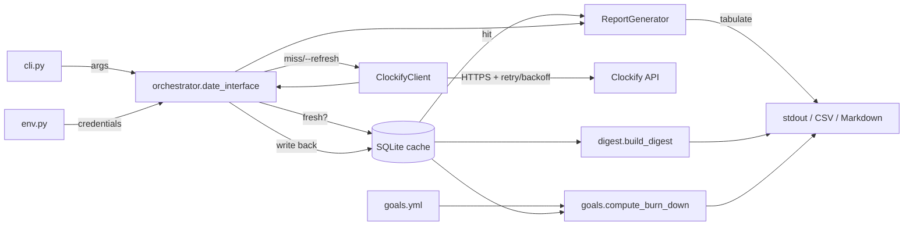

# Architecture

How clockiPy is laid out and how data flows through it.

## Module map

```
clockipy/
├── cli.py            # argparse, --verbose/--quiet, subcommand dispatch
├── env.py            # CLOCKIFY_* resolution: env > ~/rene.env > clockipy.env
├── orchestrator.py   # per-mode rendering pipeline, cache wiring
├── api/
│   ├── client.py     # ClockifyClient: Session + Retry + timeout + structured errors
│   └── errors.py     # ClockifyAPIError
├── store/
│   └── sqlite.py     # Cache: per-(workspace,user) DB, schema-versioned
├── reports/
│   ├── time_entry.py       # TimeEntry domain object (TZ-local start_date())
│   └── report_generator.py # summary tables, deviation math
├── goals.py          # ~/.config/clockipy/goals.yml + burn-down math
├── digest.py         # weekly digest with anomaly detection
├── utils/
│   ├── date_utils.py
│   ├── format_utils.py     # PT1H30M and {pH:MM} parsing
│   └── file_utils.py       # CSV + Markdown writers (with validation)
└── __main__.py       # backwards-compat shim re-exporting public symbols
```

## Data flow



## Key seams (where to extend or mock)

| Seam                                          | Why it matters                                                                |
| --------------------------------------------- | ----------------------------------------------------------------------------- |
| `orchestrator.date_interface(client=, cache=, prompt=)` | Inject mocks in tests; no module-level patching required.                  |
| `ClockifyClient(session=, timeout=)`          | Swap the HTTP layer or stiffen the timeout per call.                          |
| `Cache(db_path, now=)`                        | Inject a frozen clock for freshness tests; pass `:memory:` for fast unit IO.  |
| `Goals.load(path=)`                           | Load from anywhere — not just `$XDG_CONFIG_HOME`.                             |

## Refactor history (P2)

`__main__.py` used to be a 600+ line god-module. It now re-exports:
`main`, `date_interface`, `list_user_and_workspaces`, `load_environment`,
`load_env_file`, `get_env_var`, `prompt_for_date`. Existing scripts that did
`from clockipy.__main__ import main` keep working. New tests target the
canonical modules directly.
